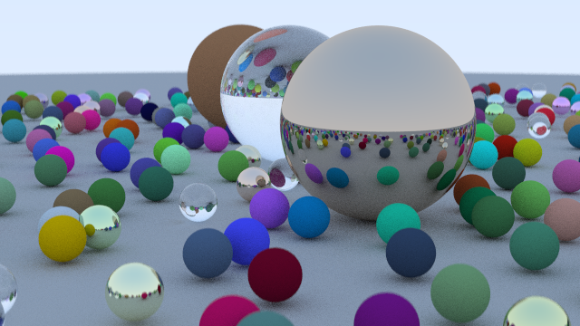
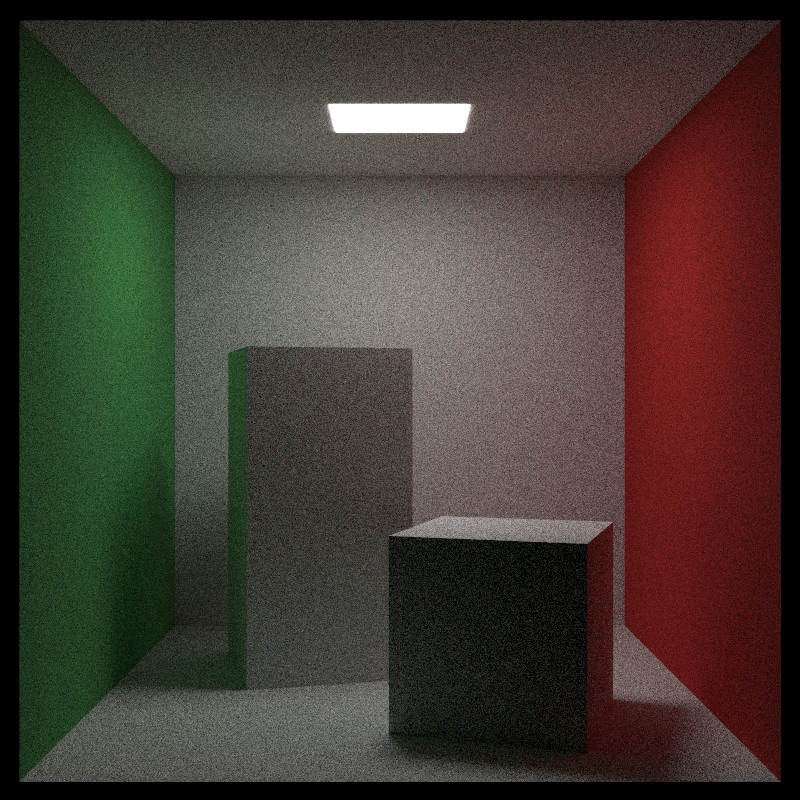

# BlazeTracer
A basic path tracer made in C++ with the book Raytracing in a weekend by Peter Shirley

# My Contribution
Make it somewhat multithreaded and some tweaks and optimizations wherever possible

[_Ray Tracing in One Weekend_](https://raytracing.github.io/books/RayTracingInOneWeekend.html)

# Final Output Part 1

# Final Output Part 2

# My Renders

